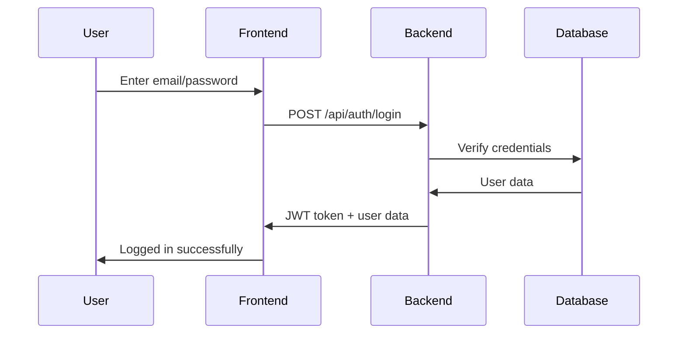
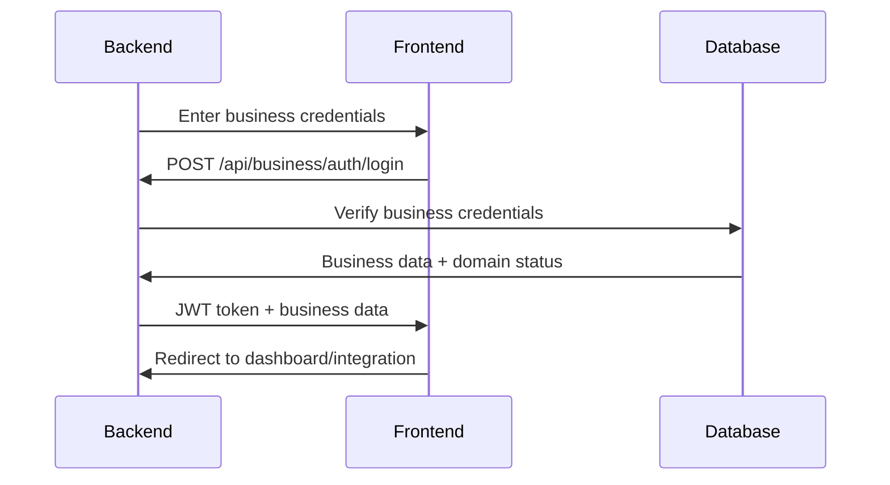
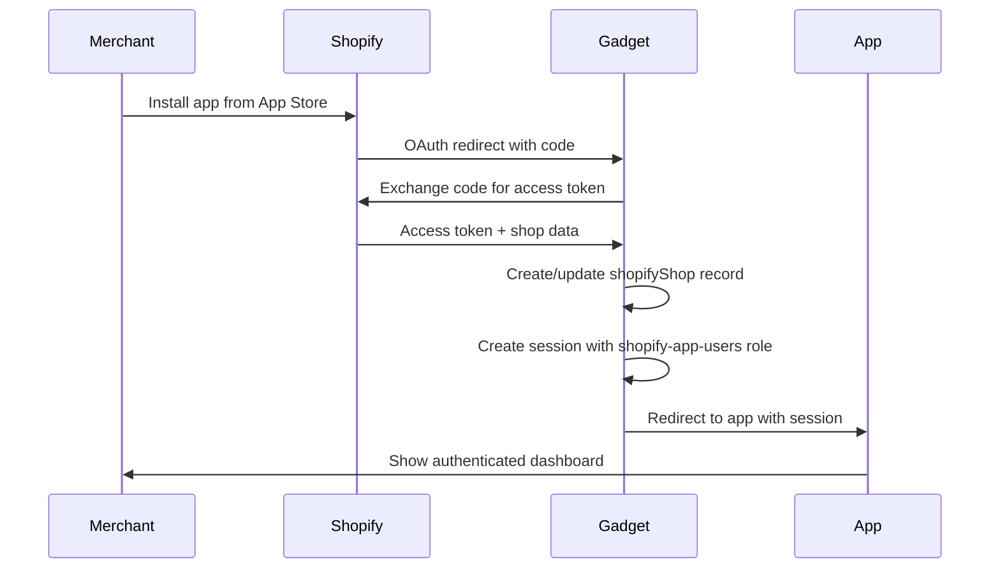
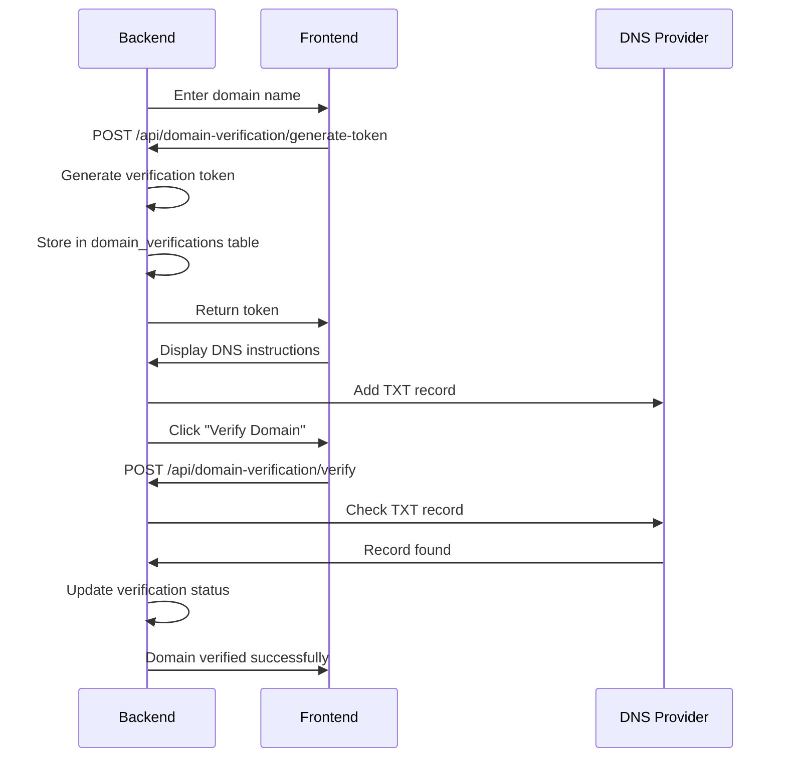
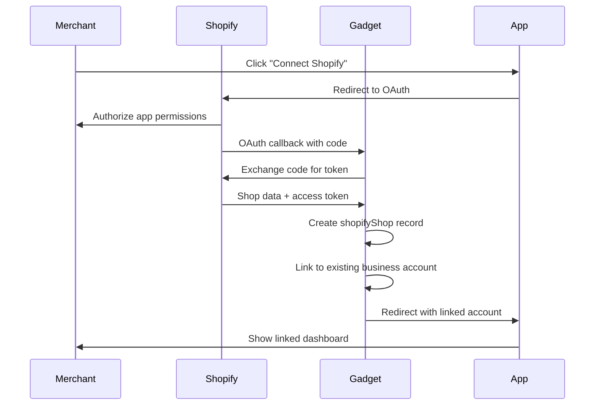

# Authentication and Account Linking System

## Overview

This document explains how the authentication and account linking system works
in the iPick platform, covering both the main application and the Shopify
integration.

## System Architecture

### 1. Multi-Tier Authentication

The system supports multiple authentication tiers:

- **Regular Users**: Consumers using the price comparison platform
- **Business Users**: Store owners/managers tracking their performance
- **Shopify Merchants**: Special Shopify app users with enhanced integration
- **Admin Users**: Platform administrators

### 2. Account Linking Flow

Users can link multiple accounts and platforms:

- Email/password authentication
- Shopify OAuth integration
- Domain verification for businesses
- Cross-platform data synchronization

## Database Schema

### Core Authentication Tables

#### 1. Users Table (Regular Users)

```sql
CREATE TABLE users (
  id SERIAL PRIMARY KEY,
  email VARCHAR(255) UNIQUE NOT NULL,
  password_hash VARCHAR(255) NOT NULL,
  first_name VARCHAR(100),
  last_name VARCHAR(100),
  created_at TIMESTAMP DEFAULT CURRENT_TIMESTAMP,
  updated_at TIMESTAMP DEFAULT CURRENT_TIMESTAMP,
  email_verified BOOLEAN DEFAULT FALSE,
  verification_token VARCHAR(255),
  reset_token VARCHAR(255),
  reset_token_expires TIMESTAMP,
  is_active BOOLEAN DEFAULT TRUE,
  last_login TIMESTAMP,
  login_count INTEGER DEFAULT 0
);
```

**Purpose**: Stores regular consumer user accounts **Key Features**:

- Email/password authentication
- Email verification system
- Password reset functionality
- Login tracking

#### 2. Businesses Table (Business Users)

```sql
CREATE TABLE businesses (
  id SERIAL PRIMARY KEY,
  name VARCHAR(255) NOT NULL,
  email VARCHAR(255) UNIQUE NOT NULL,
  password_hash VARCHAR(255) NOT NULL,
  domain VARCHAR(255) UNIQUE,
  domain_verified BOOLEAN DEFAULT FALSE,
  verification_token VARCHAR(255),
  created_at TIMESTAMP DEFAULT CURRENT_TIMESTAMP,
  updated_at TIMESTAMP DEFAULT CURRENT_TIMESTAMP,
  is_active BOOLEAN DEFAULT TRUE,
  affiliate_id VARCHAR(100) UNIQUE,
  commission_rate DECIMAL(5,2) DEFAULT 0.00,
  tracking_verified BOOLEAN DEFAULT FALSE,
  last_login TIMESTAMP,
  login_count INTEGER DEFAULT 0
);
```

**Purpose**: Stores business/merchant accounts **Key Features**:

- Domain verification system
- Affiliate tracking IDs
- Commission management
- Tracking verification

#### 3. Admins Table (Administrators)

```sql
CREATE TABLE admins (
  id SERIAL PRIMARY KEY,
  email VARCHAR(255) UNIQUE NOT NULL,
  password_hash VARCHAR(255) NOT NULL,
  name VARCHAR(255) NOT NULL,
  role VARCHAR(50) DEFAULT 'admin',
  created_at TIMESTAMP DEFAULT CURRENT_TIMESTAMP,
  last_login TIMESTAMP,
  is_active BOOLEAN DEFAULT TRUE
);
```

**Purpose**: Platform administrator accounts **Key Features**:

- Role-based access control
- Platform management capabilities

### Shopify Integration Tables

#### 4. Shopify Shops Table (Gadget)

```typescript
// checkoutdata/api/models/shopifyShop/schema.gadget.ts
{
  id: string,
  domain: string,
  myshopifyDomain: string,
  name: string,
  email: string,
  currency: string,
  planName: string,
  createdAt: Date,
  updatedAt: Date,
  // Shopify OAuth fields
  accessToken: string,
  scope: string,
  shopifySID: string
}
```

**Purpose**: Stores Shopify store information **Key Features**:

- Automatic OAuth integration
- Store metadata
- Access token management
- Multi-tenant isolation

#### 5. Sessions Table (Gadget)

```typescript
// checkoutdata/api/models/session/schema.gadget.ts
{
  id: string,
  roles: string[],
  // Shopify-specific fields
  shop: { id: string }, // Reference to shopifyShop
  shopifySID: string
}
```

**Purpose**: Manages user sessions and authentication state **Key Features**:

- Role-based permissions
- Shopify session management
- Multi-tenant session isolation

### Tracking and Analytics Tables

#### 6. Business Referrals Table (Gadget)

```typescript
// checkoutdata/api/models/businessReferral/schema.gadget.ts
{
  id: string,
  referralId: string,
  businessDomain: string,
  targetUrl: string,
  sourceUrl: string,
  productName: string,
  userId: string,
  clickedAt: Date,
  utmSource: string,
  utmMedium: string,
  utmCampaign: string,
  conversionStatus: 'pending' | 'converted' | 'abandoned',
  conversionValue: number,
  shop: { id: string } // Reference to shopifyShop
}
```

**Purpose**: Tracks referral clicks and conversions **Key Features**:

- UTM parameter tracking
- Conversion status management
- Revenue attribution
- Shop-based tenancy

#### 7. Customer Journey Table (Gadget)

```typescript
// checkoutdata/api/models/customerJourney/schema.gadget.ts
{
  id: string,
  sessionId: string,
  eventType: string,
  timestamp: Date,
  pageUrl: string,
  pageTitle: string,
  referrerUrl: string,
  productId: string,
  productName: string,
  productPrice: number,
  cartValue: number,
  discountCode: string,
  discountValue: number,
  checkoutId: string,
  orderId: string,
  utmSource: string,
  utmMedium: string,
  utmCampaign: string,
  deviceType: string,
  browserName: string,
  country: string,
  email: string,
  ipAddress: string,
  shop: { id: string }, // Reference to shopifyShop
  businessReferral: { id: string } // Optional reference
}
```

**Purpose**: Tracks user behavior and journey events **Key Features**:

- Comprehensive event tracking
- User journey mapping
- Device and browser analytics
- Geographic tracking

#### 8. Shopify Checkouts Table (Gadget)

```typescript
// checkoutdata/api/models/shopifyCheckout/schema.gadget.ts
{
  id: string,
  email: string,
  totalPrice: string,
  currency: string,
  createdAt: Date,
  completedAt: Date,
  sourceUrl: string,
  sourceName: string,
  name: string,
  token: string,
  processingStatus: string,
  customerLocale: string,
  phone: string,
  shop: { id: string } // Reference to shopifyShop
}
```

**Purpose**: Tracks Shopify checkout events **Key Features**:

- Checkout funnel tracking
- Revenue attribution
- Customer information
- Processing status

#### 9. Shopify Orders Table (Gadget)

```typescript
// checkoutdata/api/models/shopifyOrder/schema.gadget.ts
{
  id: string,
  name: string,
  email: string,
  totalPrice: string,
  currency: string,
  financialStatus: string,
  fulfillmentStatus: string,
  createdAt: Date,
  checkoutToken: string,
  sourceUrl: string,
  sourceName: string,
  shop: { id: string } // Reference to shopifyShop
}
```

**Purpose**: Tracks completed Shopify orders **Key Features**:

- Order completion tracking
- Financial status monitoring
- Fulfillment tracking
- Revenue attribution

### Domain Verification Tables

#### 10. Domain Verifications Table (Prisma)

```sql
CREATE TABLE domain_verifications (
  id SERIAL PRIMARY KEY,
  business_id INTEGER REFERENCES businesses(id),
  domain VARCHAR(255) NOT NULL,
  verification_token VARCHAR(255) NOT NULL,
  is_verified BOOLEAN DEFAULT FALSE,
  verified_at TIMESTAMP,
  created_at TIMESTAMP DEFAULT CURRENT_TIMESTAMP,
  updated_at TIMESTAMP DEFAULT CURRENT_TIMESTAMP
);
```

**Purpose**: Manages domain ownership verification **Key Features**:

- DNS-based verification
- Token-based security
- Verification status tracking

## Authentication Flow

### 1. Regular User Authentication



**Steps**:

1. User enters email and password
2. Frontend sends POST request to `/api/auth/login`
3. Backend validates credentials against `users` table
4. If valid, generates JWT token with user ID and role
5. Returns token and user data to frontend
6. Frontend stores token in localStorage/sessionStorage
7. Subsequent requests include token in Authorization header

### 2. Business User Authentication



**Steps**:

1. Business user enters email and password
2. Frontend sends POST request to `/api/business/auth/login`
3. Backend validates against `businesses` table
4. Returns JWT token with business ID and role
5. Frontend checks domain verification status
6. Redirects to appropriate dashboard or integration page

### 3. Shopify OAuth Flow



**Steps**:

1. Merchant installs app from Shopify App Store
2. Shopify redirects to Gadget with authorization code
3. Gadget exchanges code for access token
4. Gadget creates/updates `shopifyShop` record
5. Gadget creates session with `shopify-app-users` role
6. Session contains `shopId` for tenancy
7. App receives authenticated session
8. All subsequent requests are filtered by shop

## Account Linking Process

### 1. Domain Verification for Businesses



**Steps**:

1. Business user enters domain name
2. System generates unique verification token
3. Token stored in `domain_verifications` table
4. User adds TXT record to DNS: `pricehunt-verification={token}`
5. System checks DNS for verification record
6. If found, marks domain as verified
7. Business can now use tracking features

### 2. Shopify Account Linking



**Steps**:

1. Merchant clicks "Connect Shopify" in app
2. Redirected to Shopify OAuth flow
3. Merchant authorizes app permissions
4. Shopify returns authorization code
5. Gadget exchanges code for access token
6. Gadget creates `shopifyShop` record
7. Links to existing business account if available
8. Creates session with proper permissions
9. Redirects to authenticated dashboard

## Authorization and Permissions

### 1. Role-Based Access Control (RBAC)

#### Roles Defined:

- **unauthenticated**: Public access, limited functionality
- **shopify-app-users**: Shopify merchants, full shop access
- **system-admin**: Platform administrators, full access

#### Permission Structure:

```typescript
// checkoutdata/accessControl/permissions.gadget.ts
{
  "shopify-app-users": {
    models: {
      businessReferral: { read: true, actions: { create: true, update: true, delete: true } },
      customerJourney: { read: true, actions: { create: true, update: true, delete: true } },
      shopifyCheckout: { read: true },
      shopifyOrder: { read: true },
      shopifyShop: { read: true, actions: { install: true, uninstall: true, update: true } },
      userAuthorization: { read: true, actions: { create: true, update: true, delete: true } }
    }
  }
}
```

### 2. Tenancy Filters

Each custom model has tenancy filters to ensure data isolation:

```gelly
// Example: businessReferral.gelly
filter ($session: Session) on BusinessReferral [
  where shopId == $session.shopId
]
```

**Purpose**: Ensures each Shopify merchant only sees their own data

### 3. Session Management

#### Session Creation:

1. **Regular Users**: JWT token with user ID and role
2. **Business Users**: JWT token with business ID and role
3. **Shopify Users**: Gadget session with `shopify-app-users` role and `shopId`

#### Session Validation:

```typescript
// Middleware example
const requireAuth = (req, res, next) => {
    const token = req.headers.authorization?.split(" ")[1];
    if (!token) {
        return res.status(401).json({ error: "No token provided" });
    }

    try {
        const decoded = jwt.verify(token, process.env.JWT_SECRET);
        req.user = decoded;
        next();
    } catch (error) {
        return res.status(401).json({ error: "Invalid token" });
    }
};
```

## Security Features

### 1. Password Security

- Bcrypt hashing for all passwords
- Salt rounds: 12
- Password reset tokens with expiration
- Account lockout after failed attempts

### 2. Token Security

- JWT tokens with expiration (24 hours)
- Refresh token rotation
- Secure token storage (httpOnly cookies)
- CSRF protection

### 3. OAuth Security

- State parameter validation
- PKCE (Proof Key for Code Exchange)
- Secure redirect URIs
- Access token encryption

### 4. Data Protection

- Multi-tenant data isolation
- Input validation and sanitization
- SQL injection prevention
- XSS protection

## API Endpoints

### Authentication Endpoints

#### Regular Users:

- `POST /api/auth/register` - User registration
- `POST /api/auth/login` - User login
- `POST /api/auth/logout` - User logout
- `GET /api/auth/me` - Get current user
- `POST /api/auth/forgot-password` - Password reset request
- `POST /api/auth/reset-password` - Password reset

#### Business Users:

- `POST /api/business/auth/register` - Business registration
- `POST /api/business/auth/login` - Business login
- `GET /api/business/auth/me` - Get current business
- `POST /api/business/auth/logout` - Business logout
- `PUT /api/business/profile` - Update business profile

#### Domain Verification:

- `POST /api/domain-verification/generate-token` - Generate verification token
- `POST /api/domain-verification/verify` - Verify domain ownership
- `GET /api/domain-verification/status` - Check verification status

### Shopify Integration Endpoints

#### Gadget Actions:

- `trackReferral` - Track referral clicks
- `trackCustomerJourney` - Track user journey events
- `getBusinessAnalytics` - Get business analytics
- `getBusinessDashboard` - Get dashboard data

## Error Handling

### Common Error Scenarios:

1. **Invalid Credentials**:
   ```json
   { "error": "Invalid email or password", "code": "AUTH_001" }
   ```

2. **Token Expired**:
   ```json
   { "error": "Token expired", "code": "AUTH_002" }
   ```

3. **Insufficient Permissions**:
   ```json
   { "error": "Insufficient permissions", "code": "AUTH_003" }
   ```

4. **Domain Verification Failed**:
   ```json
   { "error": "Domain verification failed", "code": "DOMAIN_001" }
   ```

5. **Shopify OAuth Error**:
   ```json
   { "error": "Shopify authorization failed", "code": "SHOPIFY_001" }
   ```

## Best Practices

### 1. Security Best Practices

- Always validate user input
- Use HTTPS for all communications
- Implement rate limiting
- Log authentication events
- Regular security audits

### 2. Performance Best Practices

- Use database indexes on frequently queried fields
- Implement caching for session data
- Optimize database queries
- Use connection pooling

### 3. User Experience Best Practices

- Clear error messages
- Progressive disclosure of features
- Smooth OAuth flows
- Responsive design for all devices

## Monitoring and Analytics

### 1. Authentication Metrics

- Login success/failure rates
- Session duration
- User retention
- OAuth conversion rates

### 2. Security Monitoring

- Failed login attempts
- Suspicious activity detection
- Token usage patterns
- Domain verification success rates

### 3. Performance Monitoring

- API response times
- Database query performance
- OAuth flow completion rates
- Error rate tracking

## Troubleshooting

### Common Issues:

1. **OAuth Redirect Issues**:
   - Check redirect URI configuration
   - Verify app settings in Shopify
   - Ensure HTTPS is used

2. **Domain Verification Problems**:
   - DNS propagation delays
   - Incorrect TXT record format
   - Caching issues

3. **Session Management Issues**:
   - Token expiration
   - Cross-domain cookie issues
   - Browser privacy settings

4. **Data Isolation Problems**:
   - Missing tenancy filters
   - Incorrect session shopId
   - Filter configuration errors

## Future Enhancements

### Planned Features:

1. **Multi-Factor Authentication (MFA)**
2. **Social Login Integration**
3. **Advanced Role Management**
4. **Audit Logging**
5. **API Rate Limiting**
6. **Real-time Notifications**

This authentication and account linking system provides a secure, scalable
foundation for the iPick platform, supporting both traditional web applications
and modern Shopify integrations.
