# Authentication Flow Diagrams

## System Overview

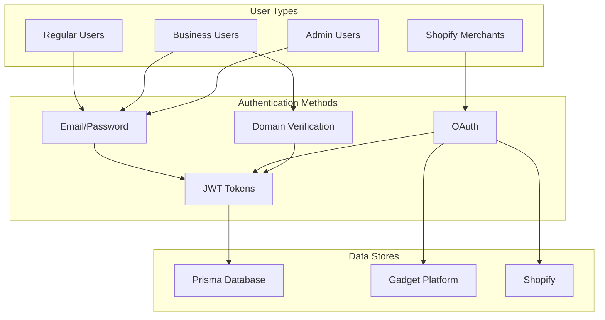

## Regular User Authentication Flow

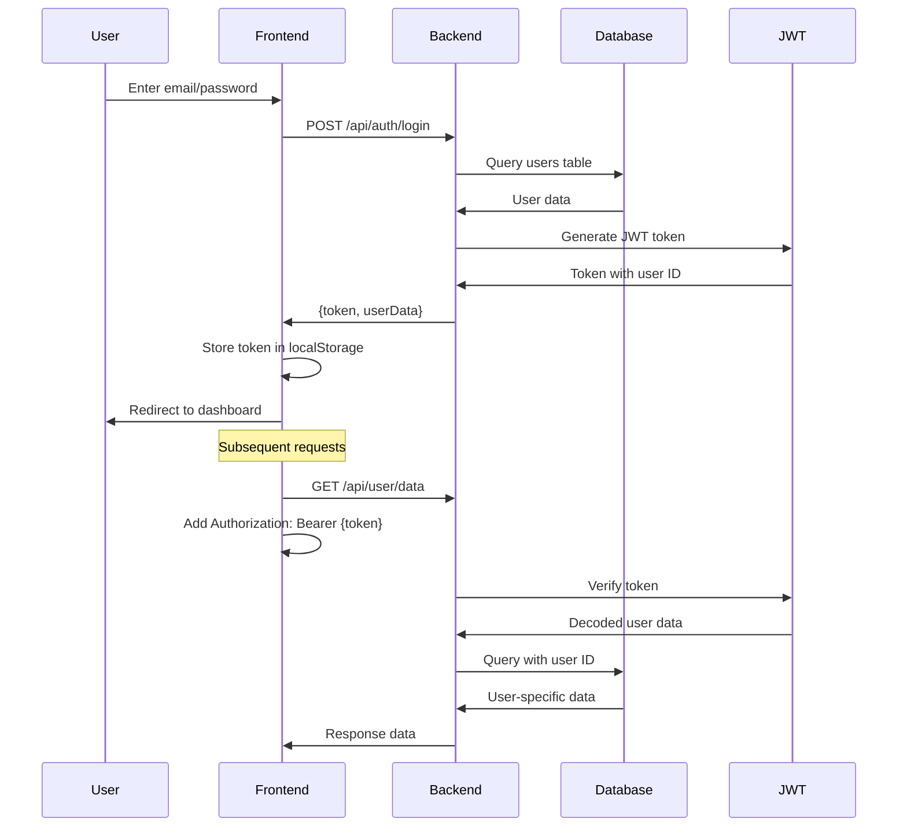

## Business User Authentication Flow

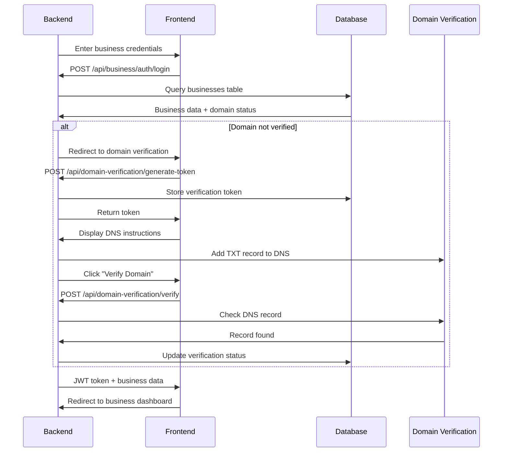

## Shopify OAuth Integration Flow

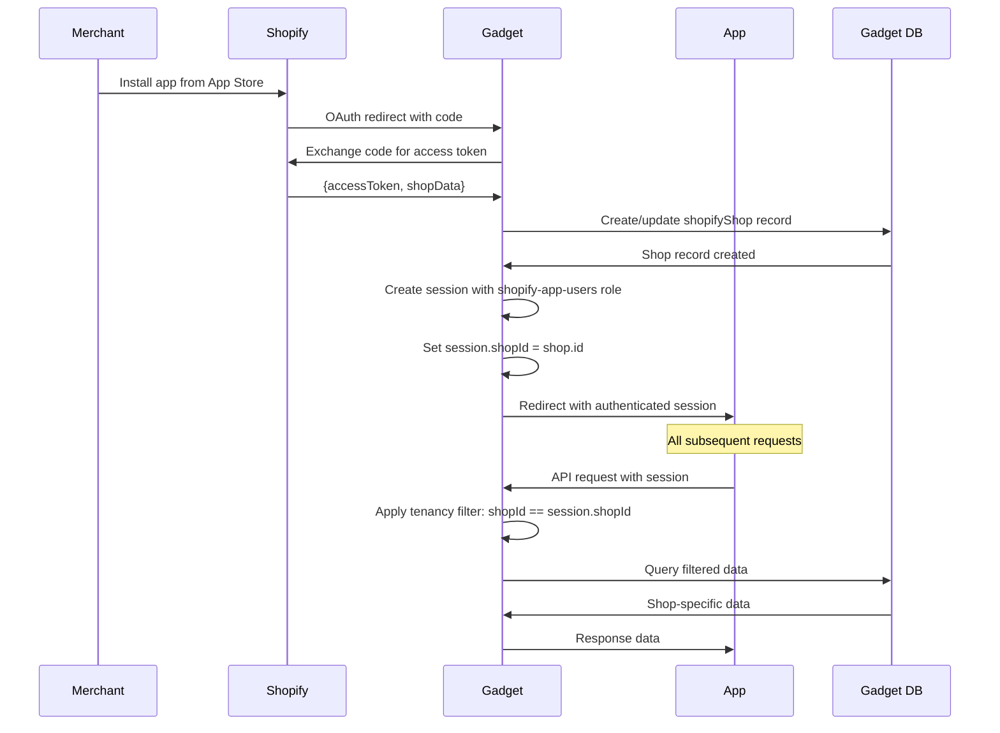

## Account Linking Process

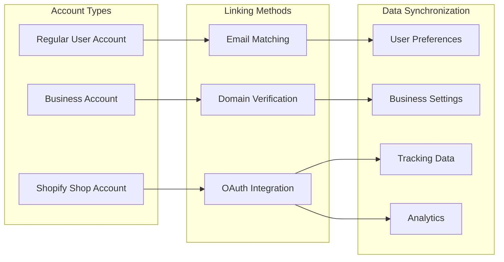

## Multi-Tenant Data Isolation

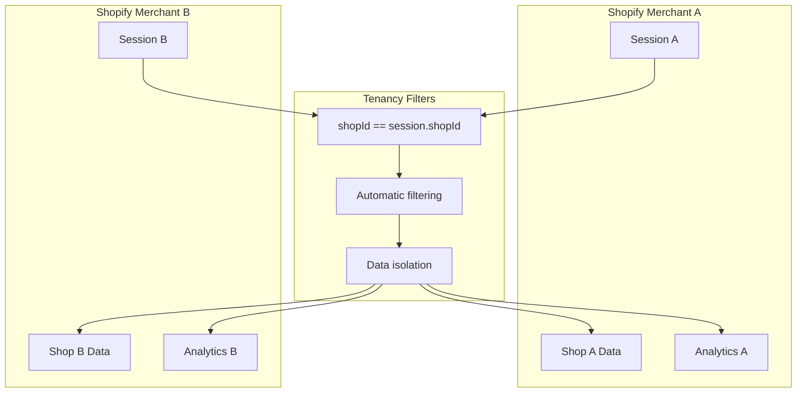

## Security Architecture

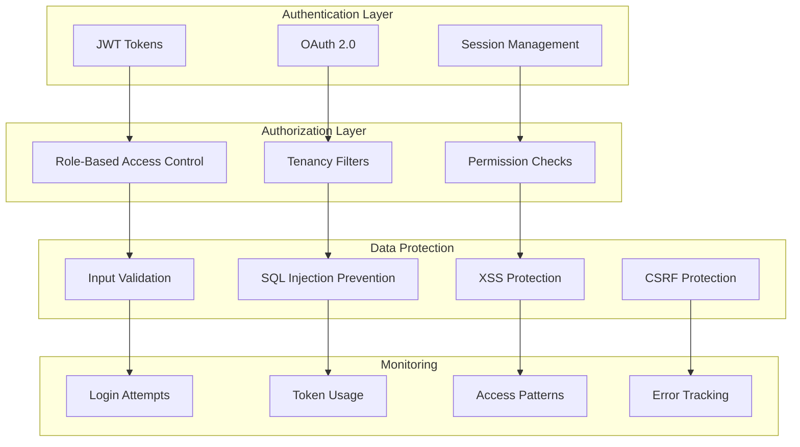

## Error Handling Flow

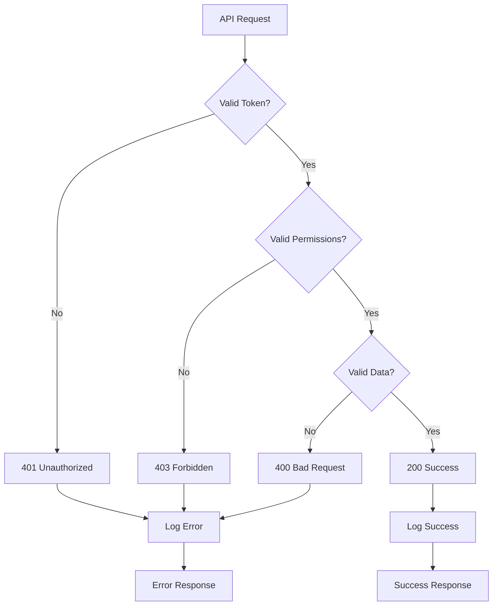

## Session Lifecycle

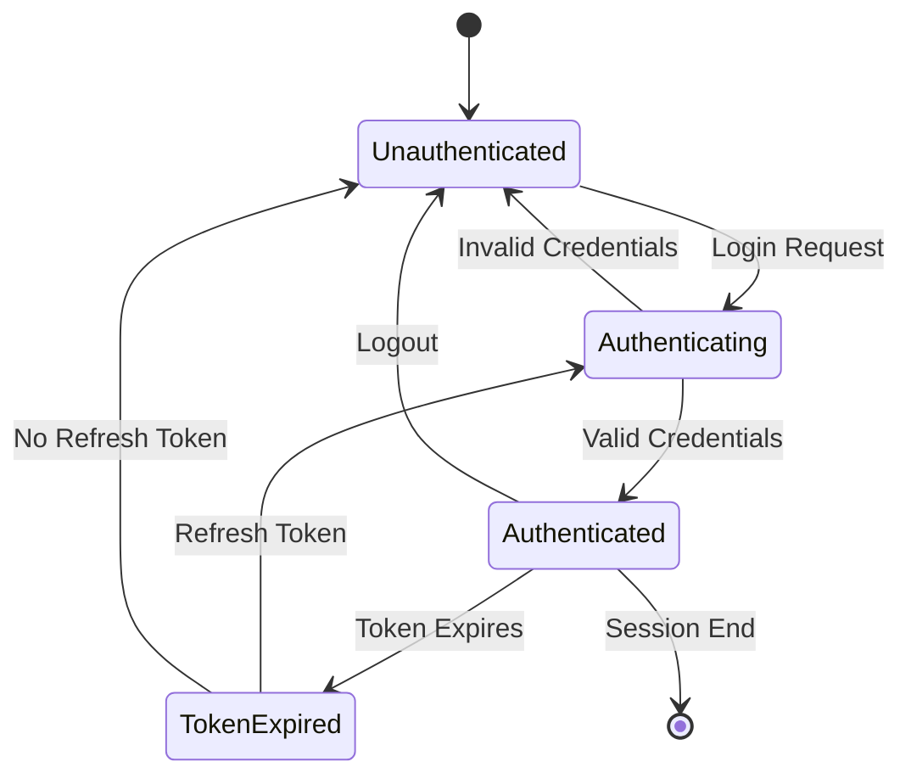

## Database Relationships

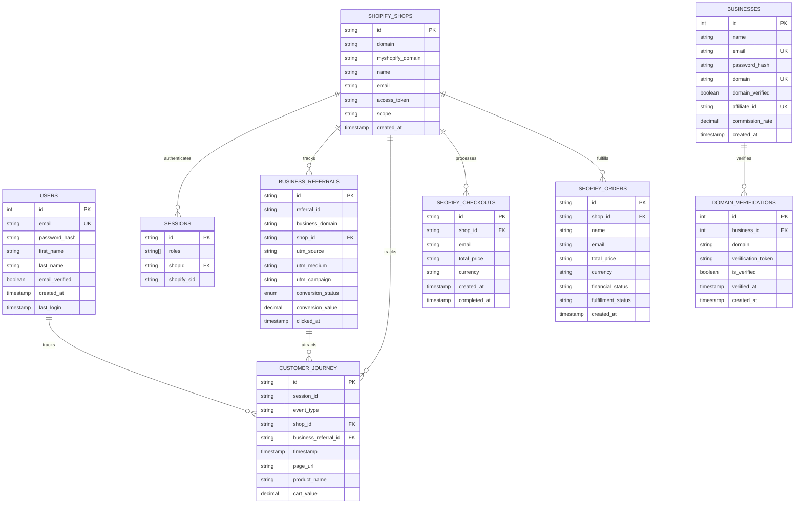

## API Endpoint Structure

```mermaid
graph TB
    subgraph "Traditional REST APIs (Main App)"
        A1[POST /api/auth/login]
        A2[POST /api/auth/register]
        A3[POST /api/auth/logout]
        A4[GET /api/auth/me]
    end
    
    subgraph "Business APIs (Main App)"
        B1[POST /api/business/auth/login]
        B2[POST /api/business/auth/register]
        B3[GET /api/business/auth/me]
        B4[PUT /api/business/profile]
    end
    
    subgraph "Domain Verification APIs (Main App)"
        D1[POST /api/domain-verification/generate-token]
        D2[POST /api/domain-verification/verify]
        D3[GET /api/domain-verification/status]
    end
    
    subgraph "Gadget GraphQL API (Shopify App)"
        G1[api.businessReferral.*]
        G2[api.customerJourney.*]
        G3[api.shopifyOrder.*]
        G4[api.shopifyCheckout.*]
        G5[api.shopifyShop.*]
    end
    
    subgraph "Gadget Actions"
        GA1[trackReferral]
        GA2[trackCustomerJourney]
        GA3[getBusinessAnalytics]
        GA4[getBusinessDashboard]
    end
    
    subgraph "Middleware & Filters"
        M1[requireAuth - JWT]
        M2[requireBusinessAuth - JWT]
        M3[requireAdmin - JWT]
        M4[Tenancy Filters - Gelly]
        M5[preventCrossShopDataAccess]
    end
    
    A1 --> M1
    B1 --> M2
    G1 --> M4
    G2 --> M4
    G3 --> M4
    G4 --> M4
    G5 --> M4
    GA1 --> M5
    GA2 --> M5
    GA3 --> M5
    GA4 --> M5
```

**Key Differences**:

- **Main App**: Uses traditional REST APIs with JWT authentication
- **Shopify App**: Uses Gadget's auto-generated GraphQL API with session-based
  authentication
- **Data Isolation**: REST APIs use middleware, GraphQL uses Gelly filters

These diagrams provide a comprehensive visual representation of the
authentication and account linking system, showing how different user types
interact with the platform and how data flows through the system.
