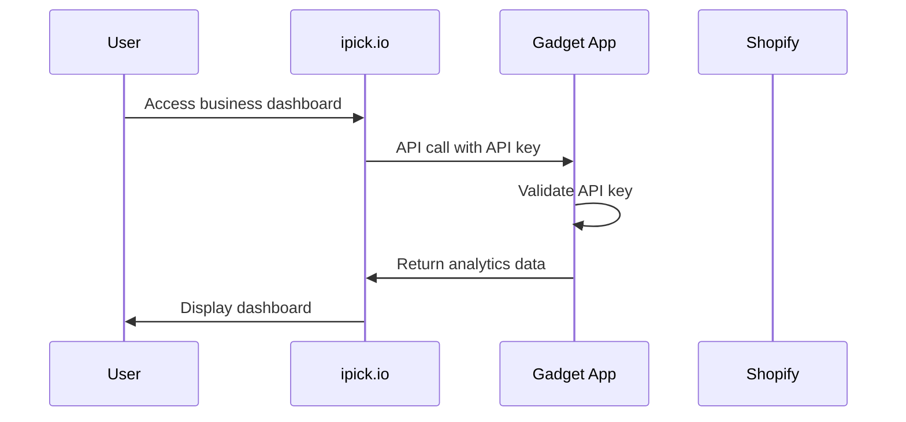
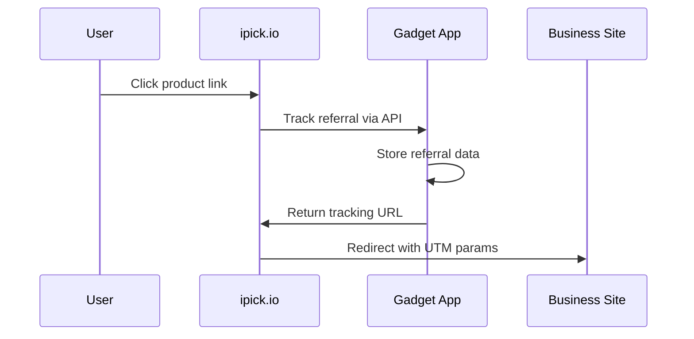

# Domain Separation and API Integration Guide

## Overview

This document outlines the separation of concerns between the main `ipick.io`
application and the Gadget-hosted Shopify app, ensuring proper domain usage and
API integration.

## Domain Architecture

### Primary Domain: `ipick.io`

- **Purpose**: Main user-facing application
- **Hosting**: Netlify
- **Users**: Regular consumers, business users, admin users
- **Features**: Product search, price comparison, business dashboards

### Gadget App: `checkoutdata.gadget.app`

- **Purpose**: Shopify integration and analytics backend
- **Hosting**: Gadget platform (Google Cloud)
- **Users**: Shopify merchants only
- **Features**: Shopify OAuth, order tracking, analytics API

## API Integration Strategy

### 1. Main App → Gadget API Calls

The main `ipick.io` application should make API calls to the Gadget app for:

- Business analytics data
- Referral tracking
- Customer journey data
- Shopify order/checkout data

### 2. Authentication Flow



### 3. Referral Tracking Flow



## Configuration Updates

### Environment Variables

```bash
# Main app environment variables
FRONTEND_URL=https://ipick.io
GADGET_API_URL=https://checkoutdata.gadget.app/api/graphql
GADGET_API_KEY=your_api_key_here

# Gadget app environment variables (separate deployment)
SHOPIFY_API_KEY=your_shopify_api_key
```

### API Endpoints

#### Main App (`ipick.io`)

- `/ref/*` - Referral redirects (handled by Netlify function)
- `/api/*` - Main app APIs
- `/track/*` - Tracking endpoints

#### Gadget App (`checkoutdata.gadget.app`)

- `/api/graphql` - GraphQL API for all data operations
- `/api/shopify/*` - Shopify-specific endpoints
- `/api/connections/*` - OAuth callbacks

## Implementation Steps

### 1. Update API Configuration

**File**: `server/services/gadget-analytics.ts`

```typescript
const GADGET_API_URL = process.env.GADGET_API_URL ||
    "https://checkoutdata.gadget.app/api/graphql";
```

**File**: `client/lib/tracking.ts`

```typescript
const SHOPIFY_TRACKING_CONFIG = {
    development: {
        apiUrl: process.env.GADGET_API_URL ||
            "https://checkoutdata.gadget.app/api/graphql",
    },
    production: {
        apiUrl: process.env.GADGET_API_URL ||
            "https://checkoutdata.gadget.app/api/graphql",
    },
};
```

### 2. Update Redirect URLs

All redirect URLs should use `ipick.io` as the primary domain:

```typescript
// ✅ Correct - Use ipick.io for user-facing URLs
const referralUrl = `https://ipick.io/ref/${affiliateId}`;

// ❌ Incorrect - Don't use Gadget domain for user-facing URLs
const referralUrl = `https://checkoutdata.gadget.app/ref/${affiliateId}`;
```

### 3. Remove Local Dependencies

The main app should not depend on local `checkoutdata/` code. Instead:

- Use API calls to Gadget app
- Store configuration in environment variables
- Handle errors gracefully when Gadget API is unavailable

### 4. Error Handling

```typescript
// Example error handling for Gadget API calls
try {
    const data = await fetchGadgetData();
    return data;
} catch (error) {
    console.error("Gadget API unavailable:", error);
    // Fallback to local data or show error message
    return { error: "Analytics temporarily unavailable" };
}
```

## Deployment Strategy

### Main App (`ipick.io`)

- **Repository**: Main repository (this one)
- **Deployment**: Netlify
- **Build Command**: `npm run build:client`
- **Functions**: `netlify/functions/`

### Gadget App (`checkoutdata.gadget.app`)

- **Repository**: Separate Gadget project
- **Deployment**: Gadget platform
- **Build**: Automatic via Gadget
- **Domain**: Managed by Gadget

## Testing Strategy

### Local Development

1. **Main App**: `npm run dev` (runs on localhost:3000)
2. **Gadget App**: Use development environment
3. **API Calls**: Point to development Gadget API

### Production Testing

1. **Main App**: Deploy to Netlify
2. **Gadget App**: Deploy to production
3. **Integration**: Test API calls between domains

## Security Considerations

### API Key Management

- Store Gadget API keys in environment variables
- Never commit API keys to repository
- Use different keys for development/production

### CORS Configuration

- Allow `ipick.io` to call `checkoutdata.gadget.app`
- Restrict other domains as needed
- Use proper authentication headers

### Data Isolation

- Each Shopify shop only sees their own data
- API calls are filtered by shop ID
- No cross-shop data access

## Monitoring and Debugging

### API Health Checks

```typescript
// Add health check endpoint
app.get("/api/health/gadget", async (req, res) => {
    try {
        const response = await fetch(GADGET_API_URL, {
            method: "POST",
            headers: { "Content-Type": "application/json" },
            body: JSON.stringify({ query: "{ __typename }" }),
        });
        res.json({ status: "healthy", gadget: response.ok });
    } catch (error) {
        res.json({ status: "unhealthy", gadget: false, error: error.message });
    }
});
```

### Logging

- Log all API calls to Gadget
- Track response times
- Monitor error rates
- Alert on API failures

## Migration Checklist

- [ ] Update all redirect URLs to use `ipick.io`
- [ ] Configure environment variables for Gadget API
- [ ] Update API client configurations
- [ ] Test referral tracking flow
- [ ] Verify analytics data integration
- [ ] Update documentation
- [ ] Test error handling
- [ ] Monitor API performance
- [ ] Set up health checks
- [ ] Configure monitoring alerts

## Future Considerations

### Scalability

- Consider caching frequently accessed data
- Implement API rate limiting
- Monitor API usage patterns

### Features

- Real-time data synchronization
- Webhook integration for live updates
- Advanced analytics dashboards

### Security

- Implement API key rotation
- Add request signing
- Enhanced audit logging

This separation ensures that:

1. **`ipick.io`** remains the primary user-facing domain
2. **Gadget app** handles Shopify-specific functionality
3. **API integration** provides seamless data flow
4. **Deployment** is independent and scalable
5. **Security** is maintained across domains
